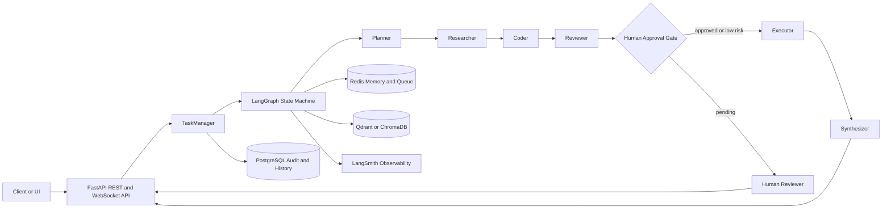

# SynapseOS

[](https://www.python.org/)
[](https://fastapi.tiangolo.com/)
[](https://langchain-ai.github.io/langgraph/)
[](https://www.docker.com/)
[](https://kubernetes.io/)

SynapseOS is an autonomous multi-agent AI orchestration platform built as a production-grade
flagship portfolio project. It coordinates specialized agents through a LangGraph state machine,
streams realtime execution events over WebSockets, stores memory in Redis, persists audit trails in
PostgreSQL, and supports RAG context through Qdrant or ChromaDB.

Author: [Shiva Charan Teja](https://github.com/shivacharanteja10)

## Features

- Six specialized agents: Planner, Researcher, Coder, Reviewer, Executor, and Synthesizer.
- LangGraph workflow with explicit state transitions and approval pause/resume behavior.
- FastAPI backend with async REST endpoints, WebSocket streaming, and typed Pydantic v2 schemas.
- Human-in-the-loop approval gate for high-risk autonomous decisions.
- Redis-backed agent memory and task queue with local fallback for tests.
- PostgreSQL conversation history and audit logs.
- Qdrant or ChromaDB vector storage for RAG context, plus deterministic local embeddings.
- LangSmith-ready observability metadata for LLM calls and agent traces.
- Docker Compose for local infrastructure and Kubernetes manifests for production deployment.
- GitHub Actions CI with linting, type checks, tests, and Docker build validation.

## Architecture



## Quick Start

```bash
git clone https://github.com/shivacharanteja10/SynapseOS.git
cd SynapseOS
cp .env.example .env
docker compose up --build
```

The API starts at `http://localhost:8000`.

```bash
curl -X POST http://localhost:8000/api/v1/tasks \
  -H "Content-Type: application/json" \
  -d '{"goal":"Design a production-ready agent workflow for incident response"}'
```

Open API docs at `http://localhost:8000/docs`.

## API

| Method | Endpoint | Purpose |
| --- | --- | --- |
| `GET` | `/api/v1/health` | Liveness probe |
| `GET` | `/api/v1/ready` | Readiness probe |
| `POST` | `/api/v1/tasks` | Submit a multi-agent task |
| `GET` | `/api/v1/tasks/{task_id}` | Fetch task snapshot |
| `WS` | `/api/v1/tasks/{task_id}/stream` | Stream realtime agent events |
| `GET` | `/api/v1/tasks/{task_id}/approvals` | List pending approvals |
| `POST` | `/api/v1/tasks/{task_id}/approvals/{decision_id}` | Approve or reject execution |
| `GET` | `/api/v1/tasks/{task_id}/audit` | Read task audit logs |

Approval body:

```json
{
  "approved": true,
  "reviewer": "platform-lead",
  "notes": "Execution plan reviewed and approved."
}
```

## Project Structure

```text
SynapseOS/
  src/synapseos/
    agents/          Specialized agent modules
    api/             FastAPI routes and dependencies
    core/            Settings, logging, exceptions
    graph/           LangGraph workflow definition
    models/          Pydantic schemas and workflow state
    services/        LLM, memory, database, vector, approval, event services
    main.py          Application factory
  tests/             Unit tests for agents, approvals, and workflow
  k8s/               Kubernetes Deployment, Service, HPA, ConfigMap, Secret
  .github/workflows/ CI pipeline
```

## Tech Stack

- Python 3.11, FastAPI, Pydantic v2, async/await
- LangGraph and LangChain for stateful agent orchestration
- Redis for memory and task queue semantics
- PostgreSQL with SQLAlchemy async for auditability
- Qdrant or ChromaDB for vector search
- structlog for structured JSON logging
- Docker Compose, Kubernetes, GitHub Actions
- LangSmith for LLM trace observability

## Local Development

```bash
python -m venv .venv
. .venv/Scripts/activate  # Windows PowerShell: .\.venv\Scripts\Activate.ps1
pip install -e ".[dev]"
pytest -q
uvicorn synapseos.main:app --reload
```

For no-key demos, keep `LLM_PROVIDER=mock`. For real LLM calls, set:

```bash
LLM_PROVIDER=openai
OPENAI_API_KEY=your-key
LANGSMITH_TRACING=true
LANGSMITH_API_KEY=your-langsmith-key
```

## Kubernetes

```bash
kubectl apply -f k8s/namespace.yaml
kubectl apply -f k8s/configmap.yaml
kubectl apply -f k8s/secret.yaml
kubectl apply -f k8s/deployment.yaml
kubectl apply -f k8s/service.yaml
kubectl apply -f k8s/hpa.yaml
```

Populate `synapseos-secrets` through your secret manager before production rollout.

## Roadmap

- Durable distributed workers with Redis Streams or Kafka.
- Browser-based approval console and timeline replay.
- Agent evaluation suite with LangSmith datasets.
- Policy engine for approval thresholds by tenant and action type.
- Multi-tenant workspace isolation and OAuth2 authentication.
- Conductor OSS workflow adapter for long-running enterprise workflows.
